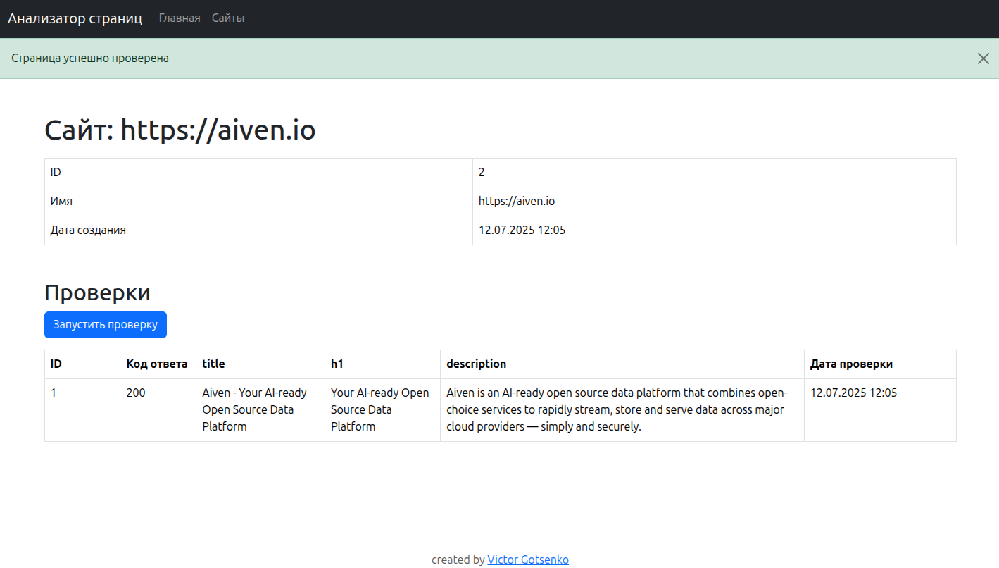

### Hexlet tests and linter status:
[](https://github.com/VictorGotsenko/java-project-72/actions)
[](https://github.com/VictorGotsenko/java-project-72/actions/workflows/JavaCI.yml)
## Description
#### Application for analyzing links for SEO suitability, is enable on <a href="https://pagesanalyzer.onrender.com" target="_blank">Link Page Analyzer</a>
Приложение – сайт, который анализирует указанные страницы на SEO пригодность.

  


### How to use:
```shell
make build-run
```

+ Used technologies:
  - Frontend: Bootstrap, JTE
  - Backend: Java, Javalin, LOMBOK, PostgreSQL, H2database, unirest-java, jsoup
  - Tests: JUnit, MockWebServer
